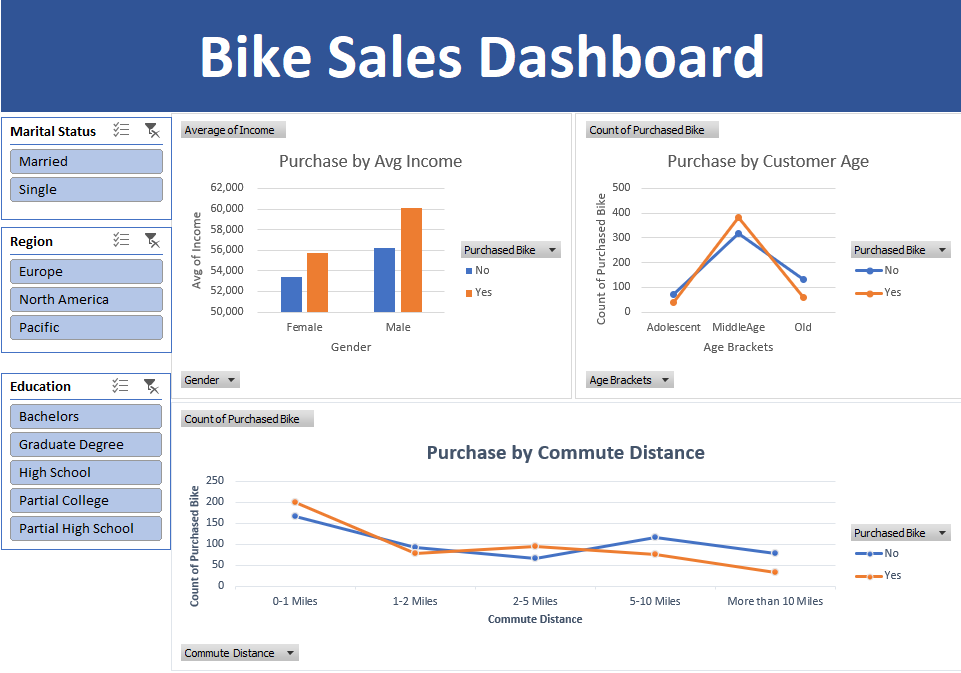

# 🚴 Bike Sales Dashboard (Excel Project)

## 📌 Project Overview
This project focuses on analyzing customer data to understand buying behavior and improve bike sales.  
Using **Excel**, raw data was transformed into an **interactive dashboard** that provides **actionable business insights**.

---

## 🎯 Business Objective
This project aims to help businesses improve bike sales by analyzing customer demographics and behavior so that better marketing and sales strategies can be developed.

---

## 🧹 Data Cleaning
The raw dataset was cleaned and prepared using Excel:

- Removed duplicate records to ensure accuracy
- Standardized categorical values (e.g., "M" → "Married", "S" → "Single")
- Created **Age Brackets** using nested IF formulas:
  - Adolescent
  - Middle Age
  - Old
- Ensured consistent formatting for analysis

---

## 📊 Data Analysis (Pivot Tables)
Pivot Tables were created to analyze key metrics:

- Average Income by Gender & Purchase Status  
- Purchase behavior based on Customer Age Brackets  
- Impact of Commute Distance on Bike Purchases  

---

## 📈 Dashboard Preview



### Dashboard has the following features:
 📊 Charts:
  - Bar Chart (Income vs Purchase)
  - Line Chart (Age vs Purchase)
  - Line Chart (Commute Distance vs Purchase)

 🎛 Filters (Slicers):
  - Marital Status
  - Region
  - Education

🎨 Clean UI:
  - Structured layout
  - Professional formatting
  - Easy-to-read visuals

---

## 🔍 Key Insights

- Middle-aged customers are the most likely to purchase bikes
- Customers with higher income show a higher tendency to purchase bikes
- Shorter commute distances (0–5 miles) are associated with higher bike purchases
- Bike purchases decrease as commute distance increases beyond 5 miles
- Male customers generally have higher average income, but purchase patterns are similar across genders
- Customer segmentation (education, region, marital status) significantly affects buying behavior

---

## 🛠 Tools Used

- Microsoft Excel  
- Pivot Tables  
- Data Cleaning Techniques  
- Slicers & Interactive Dashboard Design  

---

## 📂 Repository Structure

```
bike-sales-dashboard-excel/
│
├── dataset/
│   ├── raw/
│   │   └── bike_sales_raw.xlsx
│   │
│   ├── processed/
│   │   └── bike_sales_cleaned.xlsx
│
├── images/
│   └── bike_sales_dashboard.png
│
├── docs/
│   └── data_catalog.md  
│
├── README.md
└── .gitignore
```

---

## 🛡️ License

This project is licensed under the [MIT License](LICENSE). You are free to use, modify, and share this project with proper attribution.

## 🌟 About Me

Hi there! I'm **Sumit Sutar**. An experienced Data Analyst who uncovers hidden trends, patterns and anomalies and leverages business intelligence to generate insights, improve operational efficiency and drive organizational growth.


Let's stay in touch! Feel free to connect with me on the following platforms:

[](https://www.linkedin.com/in/sumitsutar321)
